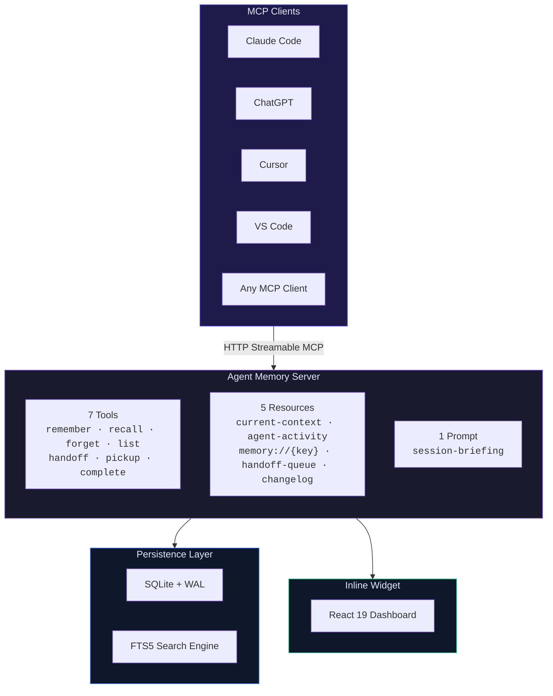
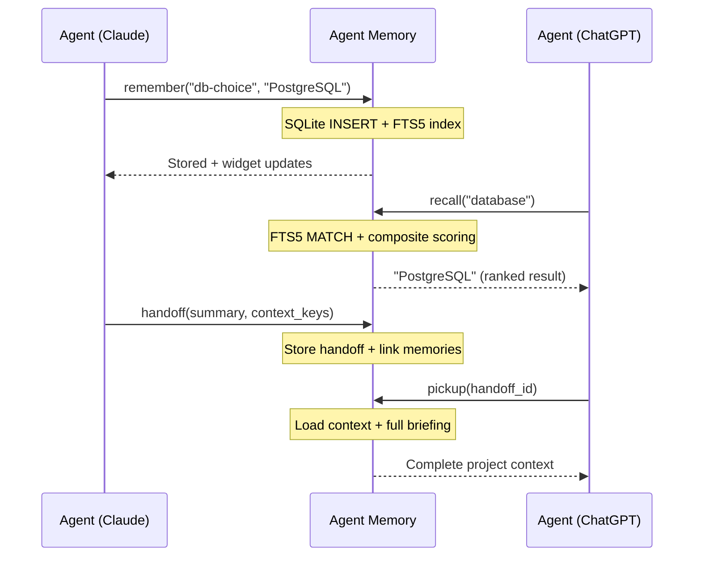
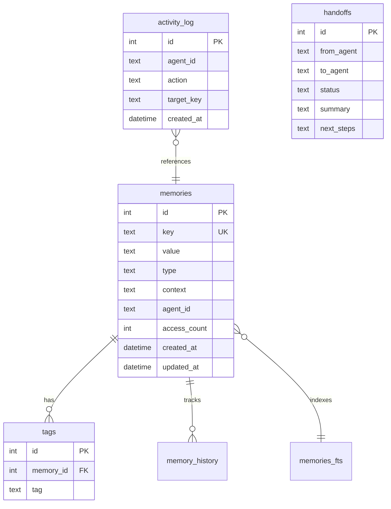

<div align="center">

<br />

<picture>
  <source media="(prefers-color-scheme: dark)" srcset="https://img.shields.io/badge/Agent_Memory-8B5CF6?style=for-the-badge&logoColor=white&logo=data:image/svg+xml;base64,PHN2ZyB4bWxucz0iaHR0cDovL3d3dy53My5vcmcvMjAwMC9zdmciIHZpZXdCb3g9IjAgMCAyNCAyNCIgZmlsbD0id2hpdGUiPjxjaXJjbGUgY3g9IjEyIiBjeT0iMTIiIHI9IjQiLz48Y2lyY2xlIGN4PSI0IiBjeT0iNiIgcj0iMiIgb3BhY2l0eT0iMC42Ii8+PGNpcmNsZSBjeD0iMjAiIGN5PSI2IiByPSIyIiBvcGFjaXR5PSIwLjYiLz48Y2lyY2xlIGN4PSI0IiBjeT0iMTgiIHI9IjIiIG9wYWNpdHk9IjAuNiIvPjxjaXJjbGUgY3g9IjIwIiBjeT0iMTgiIHI9IjIiIG9wYWNpdHk9IjAuNiIvPjxsaW5lIHgxPSIxMiIgeTE9IjEyIiB4Mj0iNCIgeTI9IjYiIHN0cm9rZT0id2hpdGUiIHN0cm9rZS13aWR0aD0iMSIgb3BhY2l0eT0iMC40Ii8+PGxpbmUgeDE9IjEyIiB5MT0iMTIiIHgyPSIyMCIgeTI9IjYiIHN0cm9rZT0id2hpdGUiIHN0cm9rZS13aWR0aD0iMSIgb3BhY2l0eT0iMC40Ii8+PGxpbmUgeDE9IjEyIiB5MT0iMTIiIHgyPSI0IiB5Mj0iMTgiIHN0cm9rZT0id2hpdGUiIHN0cm9rZS13aWR0aD0iMSIgb3BhY2l0eT0iMC40Ii8+PGxpbmUgeDE9IjEyIiB5MT0iMTIiIHgyPSIyMCIgeTI9IjE4IiBzdHJva2U9IndoaXRlIiBzdHJva2Utd2lkdGg9IjEiIG9wYWNpdHk9IjAuNCIvPjwvc3ZnPg==" />
  
</picture>

# Agent Memory

**The shared brain for AI agents**

Store context in Claude. Recall it in ChatGPT. Hand off work to Cursor.<br/>
One memory layer across every AI tool you use.

<br />

[](https://events.ycombinator.com/manufact-hackathon26)
[](https://manufact.com)
[](https://typescriptlang.org)
[](https://sqlite.org)
[](https://react.dev)
[](#license)

<br />

[Get Started](#-get-started) &nbsp;&middot;&nbsp; [Features](#-features) &nbsp;&middot;&nbsp; [Architecture](#-architecture) &nbsp;&middot;&nbsp; [API Reference](#-api-reference) &nbsp;&middot;&nbsp; [How It Works](#-how-it-works)

<br />

</div>

---

## Why

Every AI conversation starts from zero. Your agent doesn't remember you chose Supabase, prefer Tailwind, or that auth uses JWT. You re-explain — every single time.

That's **10,000-20,000 wasted tokens per day** just on repeated context. At scale, that's billions of redundant GPU cycles per month.

> [!IMPORTANT]
> Agent Memory eliminates this. Agents remember what they already know, cutting token usage by up to **60%** — less inference, less energy, less cost.

<br />

## Get Started

Connect Agent Memory to any MCP-compatible client with a single URL:

```
https://winter-meadow-1651f.run.mcp-use.com/mcp
```

<details open>
<summary><strong>Claude Desktop / Claude Code</strong></summary>

<br />

```json
{
  "mcpServers": {
    "agent-memory": {
      "url": "https://winter-meadow-1651f.run.mcp-use.com/mcp"
    }
  }
}
```

</details>

<details>
<summary><strong>ChatGPT</strong></summary>

<br />

Connect via the [Manufact MCP Apps marketplace](https://manufact.com).

</details>

<details>
<summary><strong>Cursor / VS Code / Windsurf / Cline / Roo Code / Goose / Codex</strong></summary>

<br />

Paste the URL into your MCP server configuration. Any client that speaks MCP can connect.

</details>

<details>
<summary><strong>Run locally</strong></summary>

<br />

```bash
git clone https://github.com/nihalnihalani/agent-memory.git
cd agent-memory
npm install
npm run dev
```

Then connect at `http://localhost:3010/mcp` or open the [inspector](http://localhost:3010/inspector).

</details>

<br />

## Features

<table>
<tr>
<td width="50%" valign="top">

### Intelligent Memory

- **5 memory types** — `decision` `preference` `task` `snippet` `note`
- **FTS5 search** with BM25 relevance ranking
- **Composite scoring** — relevance, recency, access frequency, type priority
- **Tag-based** organization with multi-tag filtering
- **Conflict detection** across agents

</td>
<td width="50%" valign="top">

### Cross-Agent Collaboration

- **Universal MCP** — works with every MCP-compatible client
- **Agent attribution** — every memory tagged with its creator
- **Color-coded agents** — Claude, ChatGPT, Cursor, and 10+ more
- **Activity feed** — see what each agent did and when
- **Structured handoffs** — pass work between agents seamlessly

</td>
</tr>
<tr>
<td width="50%" valign="top">

### Inline Dashboard

- **Renders inside conversations** — no separate app
- **Search, filter, sort** — full-text, by type, by date
- **Quick-add** — create memories without tool calls
- **Inline editing** — update memories in place
- **Dark & light mode** — adapts to your client

</td>
<td width="50%" valign="top">

### Agent Handoffs

- **Structured work transfer** — summary, context, next steps
- **Context inheritance** — references to relevant memories
- **Status tracking** — `pending` `in_progress` `completed`
- **One-click pickup** — accept handoffs from the dashboard
- **Auto-briefing** — new agent gets full context on pickup

</td>
</tr>
</table>

<br />

## What Makes This Different

| | Agent Memory | Others |
|---|:---:|:---:|
| Inline widget inside conversations | **Yes** | No |
| Cross-agent memory (Claude + ChatGPT + Cursor) | **Yes** | Limited |
| Agent-to-agent handoffs | **Yes** | No |
| Visual agent attribution | **Yes** | No |
| FTS5 + composite scoring | **Yes** | Keyword only |
| Zero ML dependencies | **Yes** | Often heavy |
| Single URL to connect | **Yes** | Complex setup |

<br />

## Architecture



### Data Flow



<br />

## API Reference

### Tools

| Tool | Description |
|:-----|:------------|
| **`remember`** | Store a memory with key, value, type, tags, and context. Handles conflicts when agents update the same key. |
| **`recall`** | Full-text search with FTS5 + BM25 composite scoring. Returns ranked results by relevance, recency, and access patterns. |
| **`forget`** | Delete a memory by key with cascading cleanup of tags and history. |
| **`list-memories`** | Browse memories with pagination, type filtering, and tag filtering. |
| **`handoff`** | Create an agent-to-agent work transfer with summary, stuck reason, next steps, and context references. |
| **`pickup`** | Accept a pending handoff. Auto-loads context memories and relevant decisions for a full briefing. |
| **`complete-handoff`** | Mark a handoff as completed with a result summary. |

### Resources

| URI | Description |
|:-----|:------------|
| **`memory://current-context`** | Full project briefing: decisions, preferences, recent tasks, stats, pending handoffs. *This is what saves tokens.* |
| **`memory://agent-activity`** | Agent action feed — who did what and when across all agents. |
| **`memory://{key}`** | Look up a specific memory by key. |
| **`memory://handoff-queue`** | All pending, in-progress, and recently completed handoffs. |
| **`memory://changelog`** | Memory modification history with old vs. new values and agent attribution. |

### Prompt

| Name | Description |
|:-----|:------------|
| **`session-briefing`** | Full agent onboarding. Optional `focus` parameter to filter context to a specific topic. |

<br />

## How It Works

### Composite Scoring

When you `recall`, Agent Memory ranks results using four signals:

```
Score = (0.6 × BM25) + (0.2 × Recency) + (0.1 × Access) + (0.1 × Type)
```

| Signal | Weight | Why |
|:-------|:------:|:----|
| **BM25 Relevance** | 60% | Most relevant results first |
| **Recency** | 20% | Recent memories surface higher |
| **Access Count** | 10% | Frequently used = important |
| **Type Priority** | 10% | `decision` > `preference` > `task` > `snippet` > `note` |

### Database Schema

SQLite in WAL mode with FTS5 for full-text search:



> [!TIP]
> The `memory://current-context` resource automatically surfaces your decisions and preferences at the start of every conversation — so the agent already has your context without you spending tokens re-explaining it.

<br />

## Token Savings

| Scale | Daily Waste | With Agent Memory |
|:------|:------------|:------------------|
| **1 user** | 10K-20K tokens | Eliminated |
| **1,000 users** | 10M-20M tokens | ~60% reduction |
| **1M users** | 10B-20B tokens | Billions saved |

Every token saved is a GPU cycle that doesn't fire. At scale, Agent Memory is infrastructure for sustainable AI.

<br />

## Tech Stack

| Layer | Technology |
|:------|:-----------|
| **Language** | TypeScript 5.9 |
| **Framework** | [Manufact SDK](https://manufact.com) (mcp-use) |
| **Database** | SQLite via `better-sqlite3` (WAL mode) |
| **Search** | FTS5 with BM25 + Porter stemming |
| **Validation** | Zod 4 |
| **UI** | React 19 + Tailwind CSS v4 |
| **Build** | Vite 7 |
| **Server** | Express 5 |
| **Deployment** | Manufact MCP Cloud (Fly.io) |

<br />

<details>
<summary><strong>Project Structure</strong></summary>

<br />

```
agent-memory/
├── index.ts                          # MCP server — 7 tools, 5 resources, 1 prompt
├── src/
│   ├── db/
│   │   ├── schema.ts                 # SQLite schema + FTS5 setup
│   │   ├── queries.ts                # Database operations
│   │   └── seed.ts                   # Demo data
│   └── tools/
│       └── helpers.ts                # Agent names + formatting
├── resources/
│   └── memory-dashboard/
│       ├── widget.tsx                # Interactive dashboard (1,400+ lines)
│       ├── types.ts                  # TypeScript interfaces
│       ├── utils.ts                  # Agent colors, helpers
│       └── components/
│           ├── MemoryCard.tsx         # Memory display
│           ├── SearchBar.tsx          # FTS5 search input
│           ├── TypeFilter.tsx         # Type selector
│           ├── StatsBar.tsx           # Statistics
│           ├── ActivityFeed.tsx       # Agent timeline
│           ├── HandoffCard.tsx        # Handoff display
│           └── QuickAddForm.tsx       # Quick memory creation
├── public/                            # Static assets
├── data/                              # SQLite database (runtime)
└── dist/                              # Compiled output + widget manifest
```

</details>

<details>
<summary><strong>Deploy</strong></summary>

<br />

```bash
npm run build
npm run deploy
```

Deployed at `https://winter-meadow-1651f.run.mcp-use.com/mcp` — accessible from any MCP client worldwide.

</details>

<br />

---

<div align="center">

**Built for the [MCP Apps Hackathon 2026](https://events.ycombinator.com/manufact-hackathon26) at Y Combinator**

Powered by [Manufact](https://manufact.com)

<br />

[](https://typescriptlang.org)
[](https://react.dev)
[](https://sqlite.org)
[](https://tailwindcss.com)
[](https://nodejs.org)
[](https://vite.dev)

</div>
